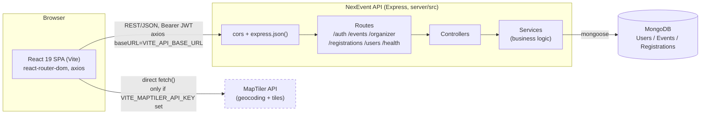
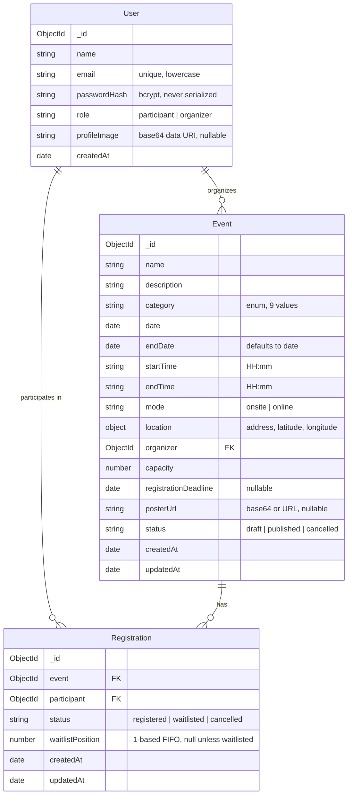
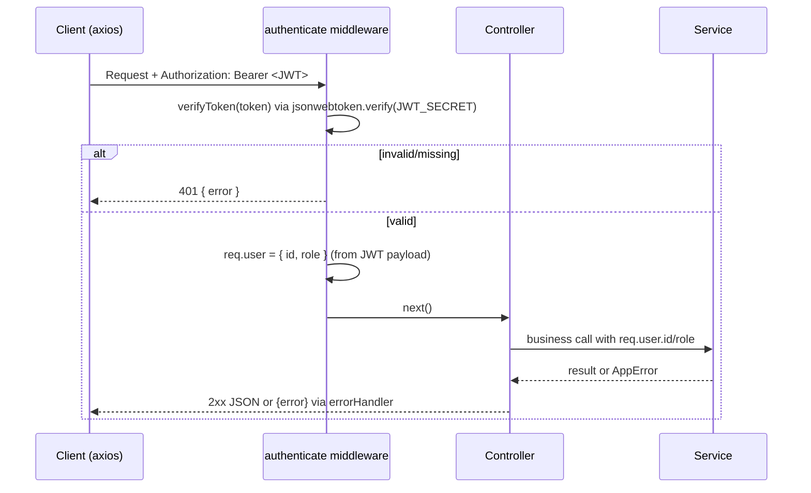
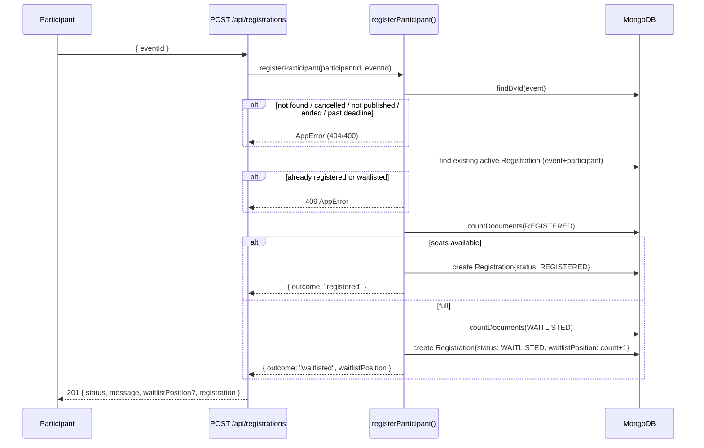
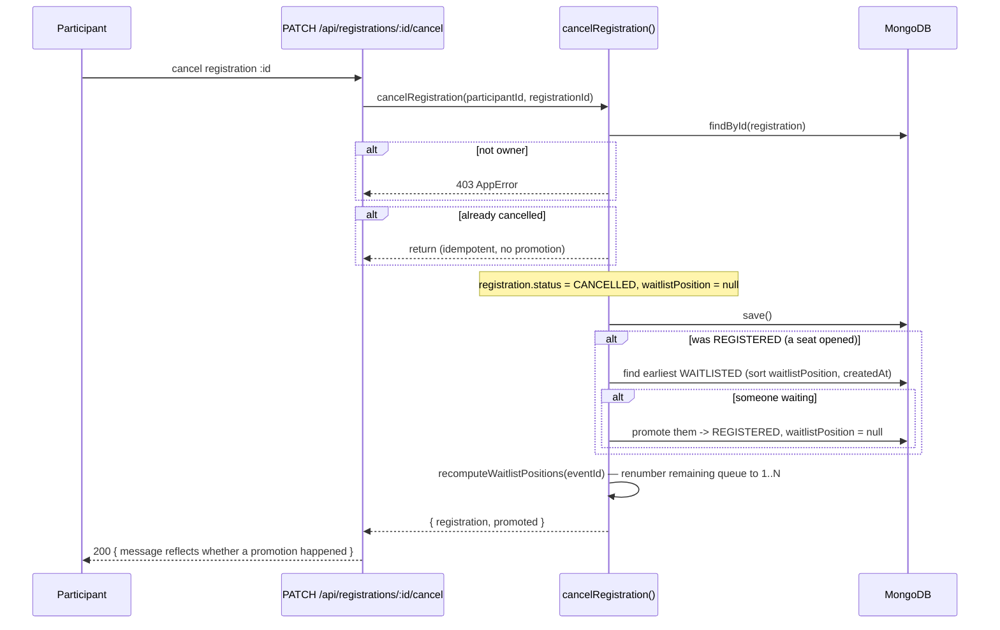
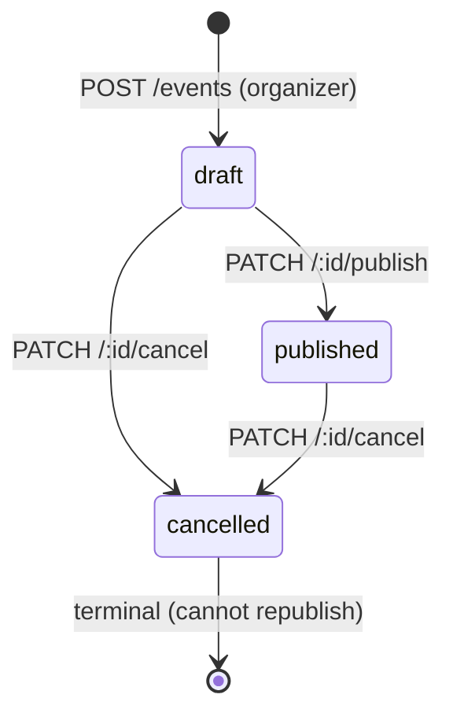

# NexEvent — System Design Document

Reverse-engineered from the current codebase. Every non-trivial claim below cites the file it was derived from.

## 1. Architecture Overview

Classic three-tier MERN app: a Vite/React SPA talking to a stateless Express/Mongoose REST API over JSON, backed by a single MongoDB database. No server-rendering, no background job queue, no separate cache layer.

- The client never proxies map requests through the backend — `EventMap.jsx` calls MapTiler's geocoding/tile endpoints directly from the browser using `VITE_MAPTILER_API_KEY` ([client/src/components/EventMap.jsx:15,28,89-91](client/src/components/EventMap.jsx)). If that key is unset, the component renders a plain address input/text instead of a map — the app never fails to build or run without it ([client/src/components/EventMap.jsx:212-220](client/src/components/EventMap.jsx), confirmed in [README.md](README.md)).
- In dev, Vite proxies `/api/*` to the backend as a fallback when `VITE_API_BASE_URL` is unset ([client/vite.config.js](client/vite.config.js)); in the deployed/configured case, axios talks directly to `VITE_API_BASE_URL` ([client/src/services/api.js:5-7](client/src/services/api.js)).
- The backend is a single Express process (`server/src/server.js`) with a layered structure: `routes/` → `controllers/` (thin, just call a service + shape the response) → `services/` (all business logic) → `models/` (Mongoose schemas). Validation lives in a separate `validators/` layer called from services, not middleware.

## 2. Tech Stack

| Layer | Technology | Version (package.json) |
|---|---|---|
| Frontend framework | React | ^19.2.8 |
| Frontend build tool | Vite | ^8.3.0 |
| Routing | react-router-dom | ^7.18.4 |
| HTTP client | axios | ^1.7.7 |
| Styling | Tailwind CSS (`@tailwindcss/vite`) | ^4.1.4 |
| Animation | framer-motion | ^13.4.0 |
| Charts | recharts | ^3.10.1 |
| Maps / geocoding | maplibre-gl + MapTiler API | ^6.10.0 |
| Linting | oxlint | ^1.81.0 |
| Backend runtime | Node.js (ESM, `"type": "module"`) | 18+ (per README) |
| Backend framework | Express | ^4.19.2 |
| ODM | Mongoose | ^8.5.1 |
| Auth | jsonwebtoken + bcryptjs | ^9.0.2 / ^2.4.3 |
| Dev server reload | nodemon | ^3.1.4 |
| Test tooling (configured, unused) | jest, supertest, mongodb-memory-server | ^29.7.0 / ^7.0.0 / ^9.4.0 — no test files exist in the repo |

Source: [server/package.json](server/package.json), [client/package.json](client/package.json).

## 3. Data Model

Three collections, all Mongoose schemas in `server/src/models/`. No stored aggregate/counter fields anywhere — seat counts, waitlist counts, and analytics are always computed via `Registration.countDocuments`/`.aggregate` at request time ([server/src/services/event.service.js:45-55](server/src/services/event.service.js)).

**Indexes:**
- `Event`: `{ status: 1, date: 1 }` (discovery/listing), `{ organizer: 1 }` (dashboard) — [server/src/models/Event.js:37-38](server/src/models/Event.js)
- `Registration`: `{ event: 1, participant: 1 }` (duplicate-registration lookups), `{ event: 1, status: 1 }` (seat/waitlist counts) — [server/src/models/Registration.js:23-24](server/src/models/Registration.js). Neither is a *unique* index, so the one-active-registration-per-participant rule is application-enforced only ([server/src/services/registration.service.js:77-88](server/src/services/registration.service.js)).
- `User.email` has a unique index ([server/src/models/User.js:9-13](server/src/models/User.js)).

`displayStatus` (Draft/Upcoming/Almost Full/Full/Ongoing/Completed/Cancelled) is never persisted — it's derived on every read from `status` + `date`/`endDate`/`startTime`/`endTime` + a live registered count ([server/src/utils/deriveDisplayStatus.js](server/src/utils/deriveDisplayStatus.js)).

## 4. API Design

Base path `/api`. All routes except `GET /api/health`, `GET /api/events`, `GET /api/events/:id`, `POST /api/auth/register`, `POST /api/auth/login` require `Authorization: Bearer <JWT>`.

| Method & Path | Auth | Handler → Service | Purpose |
|---|---|---|---|
| GET `/health` | none | [health.routes.js](server/src/routes/health.routes.js) | Liveness + DB connection state |
| POST `/auth/register` | none | `auth.controller.signup` → `registerUser` | Create account, returns `{ user, token }` |
| POST `/auth/login` | none | `auth.controller.login` → `loginUser` | Returns `{ user, token }` |
| GET `/auth/me` | required | `auth.controller.me` → `getUserById` | Current user profile |
| PATCH `/auth/me` | required | `auth.controller.updateProfile` → `updateUserProfile` | Update name/profileImage only |
| PATCH `/auth/me/password` | required | `auth.controller.changePassword` → `changeUserPassword` | Requires current password |
| GET `/events` | none | `event.controller.list` → `listPublishedEvents` | Published events; `category`/`date`/`search`/`sort` query params |
| GET `/events/recommended` | participant | `event.controller.recommended` → `getRecommendedEvents` | Ranked recommendations |
| GET `/events/:id` | optional | `event.controller.getById` → `getEventById` | 404s a draft to non-owners; includes viewer's registration state if authed |
| POST `/events` | organizer | `event.controller.create` → `createEvent` | Creates in `draft` status |
| PUT `/events/:id` | organizer, owner | `event.controller.update` → `updateEvent` | Full field replace via `pickEventFields` |
| PATCH `/events/:id/publish` | organizer, owner | `event.controller.publish` → `publishEvent` | `draft/published → published`; blocks if `cancelled` |
| PATCH `/events/:id/cancel` | organizer, owner | `event.controller.cancel` → `cancelEvent` | → `cancelled`; registrations untouched |
| GET `/events/:id/registrations` | organizer, owner | `registration.controller.eventRegistrations` → `getEventRegistrations` | Participant list for one event |
| GET `/events/:id/analytics` | organizer, owner | `analytics.controller.eventAnalytics` → `getEventAnalytics` | Per-event stats |
| GET `/organizer/events` | organizer | `event.controller.organizerEvents` → `getOrganizerEvents` | All of the caller's events + waitlist counts |
| GET `/organizer/analytics` | organizer | `analytics.controller.dashboard` → `getOrganizerDashboardAnalytics` | Aggregate dashboard stats |
| POST `/registrations` | participant | `registration.controller.register` → `registerParticipant` | Register or auto-waitlist; body `{ eventId }` |
| PATCH `/registrations/:id/cancel` | participant, owner | `registration.controller.cancel` → `cancelRegistration` | Cancels; may trigger waitlist promotion |
| GET `/users/me/registrations` | participant | `registration.controller.myRegistrations` → `getParticipantRegistrations` | Caller's registrations, newest first |

Every JSON response body wraps its payload in a named key (`{ event }`, `{ events }`, `{ user }`, `{ registrations }`, `{ analytics }`) — see each controller in [server/src/controllers/](server/src/controllers). Errors are always `{ error: "<message>" }` with an appropriate HTTP status, produced by the centralized handler ([server/src/middleware/errorHandler.js](server/src/middleware/errorHandler.js)).

## 5. Auth & Security

- **Password storage**: bcrypt, 10 salt rounds ([server/src/services/auth.service.js:6](server/src/services/auth.service.js)). `passwordHash` is stripped from every `User` JSON response via a Mongoose `toJSON` transform, not per-response filtering ([server/src/models/User.js:27-33](server/src/models/User.js)).
- **Tokens**: `jsonwebtoken.sign({ userId, role }, JWT_SECRET, { expiresIn: JWT_EXPIRES_IN })`, default 7 days ([server/src/utils/jwt.js](server/src/utils/jwt.js), [server/src/config/env.js:19](server/src/config/env.js)). No refresh token, no server-side blacklist/revocation — a JWT is valid until it expires even after "logout" (which is purely client-side `localStorage.removeItem`) ([client/src/context/AuthContext.jsx:56-60](client/src/context/AuthContext.jsx)).
- **Route protection**: three middleware functions — `authenticate` (required), `optionalAuthenticate` (attaches `req.user` if present, never blocks — used on `GET /events/:id` so guests can view published events while owners still see drafts), `authorize(...roles)` (role allowlist, 403 otherwise) ([server/src/middleware/auth.middleware.js](server/src/middleware/auth.middleware.js)).
- **Resource ownership** (an organizer editing *another* organizer's event, or a participant cancelling *someone else's* registration) is checked inside the service layer by comparing IDs, not by middleware — see `findOwnedEvent` ([server/src/services/event.service.js:66-73](server/src/services/event.service.js)) and the participant check in `cancelRegistration` ([server/src/services/registration.service.js:121-123](server/src/services/registration.service.js)).
- **CORS**: production locks to `CLIENT_URL`; development accepts any `http(s)://localhost:<port>` or `127.0.0.1:<port>` origin via a dynamic origin function ([server/src/app.js:14-29](server/src/app.js)).
- **Frontend route guards**: `ProtectedRoute` redirects unauthenticated users to `/login` (preserving the intended destination in router state) and redirects wrong-role users to `/explore`; this is a UX convenience only — the API is the actual enforcement boundary ([client/src/routes/ProtectedRoute.jsx](client/src/routes/ProtectedRoute.jsx)).

## 6. Key Workflows

### 6.1 Registration → waitlist join

Source: [server/src/services/registration.service.js:53-116](server/src/services/registration.service.js).

### 6.2 Cancellation → waitlist promotion

Source: [server/src/services/registration.service.js:118-155](server/src/services/registration.service.js). Cancelling a *waitlisted* (not registered) entry skips the promotion branch entirely — only the recompute runs, closing the gap.

### 6.3 Event lifecycle

`publishEvent` blocks the `cancelled → published` transition explicitly ([server/src/services/event.service.js:95-97](server/src/services/event.service.js)); there's no `published → draft` (unpublish) transition anywhere in the API.

## 7. Environment / Configuration

| Variable | Read by | Effect if unset |
|---|---|---|
| `MONGO_URI` | [server/src/config/env.js](server/src/config/env.js) / `db.js` | Server refuses to start — `connectDB()` throws ([server/src/config/db.js:5-7](server/src/config/db.js)) |
| `JWT_SECRET` | [server/src/utils/jwt.js](server/src/utils/jwt.js) | Warned on boot ([server/src/config/env.js:7-12](server/src/config/env.js)); token signing/verification breaks at runtime |
| `JWT_EXPIRES_IN` | [server/src/config/env.js:19](server/src/config/env.js) | Defaults to `7d` |
| `PORT` | [server/src/config/env.js:16](server/src/config/env.js) | Defaults to `5000` |
| `NODE_ENV` | [server/src/config/env.js:15](server/src/config/env.js), [app.js:20-21](server/src/app.js) | Defaults to `development`; controls CORS strictness |
| `CLIENT_URL` | [server/src/app.js:22](server/src/app.js) | Defaults to `http://localhost:5173`; only enforced in production CORS |
| `MAPTILER_API_KEY` | [server/src/config/env.js:20](server/src/config/env.js) | Present in server env but **not read anywhere else in `server/src`** — the map integration is entirely client-driven (see §1); this var appears vestigial on the backend |
| `VITE_API_BASE_URL` | [client/src/services/api.js:6](client/src/services/api.js) | Falls back to relative `/api`, relying on the Vite dev proxy |
| `VITE_API_PROXY_TARGET` | [client/vite.config.js:12](client/vite.config.js) | Falls back to `http://localhost:5000` |
| `VITE_MAPTILER_API_KEY` | [client/src/components/EventMap.jsx:15](client/src/components/EventMap.jsx) | Map/geocoding UI degrades to a plain address text field (§1) |

## 8. Known Limitations / Scalability Notes

- **Capacity check race condition** — documented in-code as an accepted limitation: two concurrent registration requests for the last seat can both pass the `count < capacity` check before either writes, allowing a rare over-capacity registration. No transaction/atomic `findOneAndUpdate` guard is used ([server/src/services/registration.service.js:44-51](server/src/services/registration.service.js)).
- **No unique index backing the "one active registration per participant per event" rule** — enforced only by a read-then-write check in `registerParticipant`, same race class as above ([server/src/services/registration.service.js:77-101](server/src/services/registration.service.js), [server/src/models/Registration.js:23-24](server/src/models/Registration.js)).
- **No pagination anywhere** — `Event.find()`/`Registration.find()` calls across `event.service.js`, `registration.service.js`, and `discovery.service.js` return unbounded result sets. Fine at hackathon/demo data volumes (the seed script creates 6 events, 4 users — [server/scripts/seed.js](server/scripts/seed.js)); would need `limit`/`skip` or cursor-based paging before real-world scale.
- **Analytics recompute from scratch on every request** — `getOrganizerDashboardAnalytics` and `getRecommendedEvents` run full aggregations across all of an organizer's/all participants' data on each call rather than caching; acceptable at current scale given the lack of a cache layer, but would need one (Redis, etc.) under load.
- **No rate limiting or request throttling** on any endpoint, including `POST /api/auth/login` (brute-force is unmitigated beyond bcrypt's inherent cost) ([server/src/app.js](server/src/app.js)).
- **Images stored as base64 in MongoDB documents**, not object storage — inflates document size (capped at ~5MB decoded per image) and query/transfer cost; a deliberate, explicitly-commented time-constraint tradeoff rather than an oversight ([server/src/models/User.js:20-22](server/src/models/User.js), [server/src/models/Event.js:24-26](server/src/models/Event.js)).
- **Single MongoDB instance, no sharding/replica awareness in code** — `mongoose.connect(MONGO_URI)` with default settings ([server/src/config/db.js](server/src/config/db.js)); horizontal scaling would be an infrastructure-level change, not a code one.
- **No automated test suite** despite configured tooling — see PRD §6. This means none of the above (or any other) behavior is regression-protected.

---
Verified against commit `1c3b4a1`.
